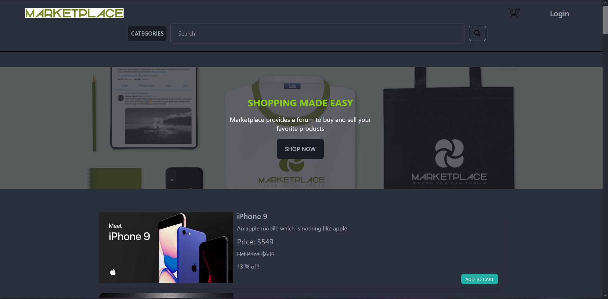
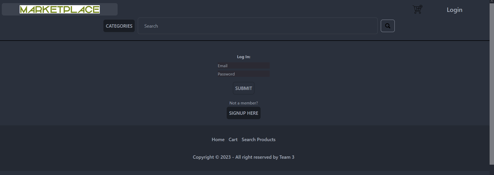
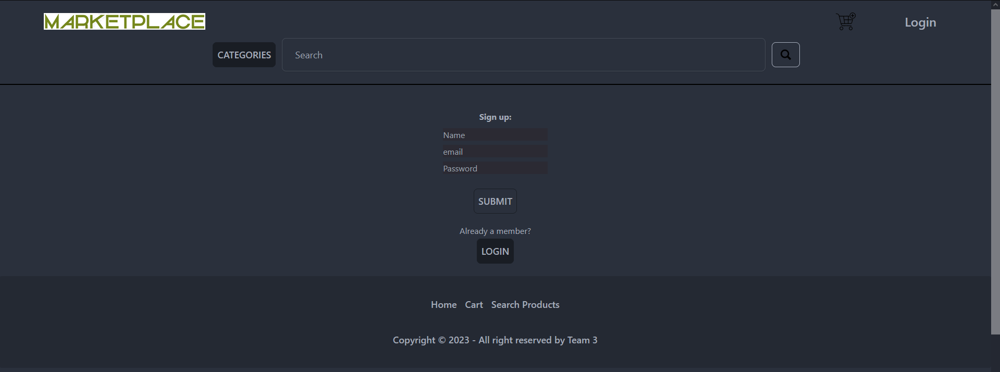
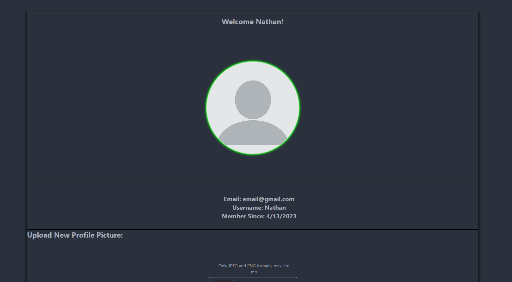
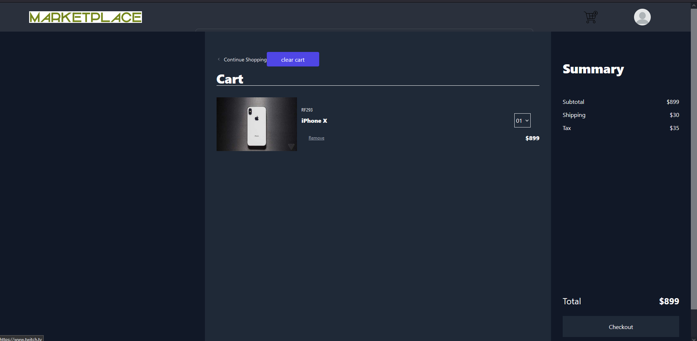
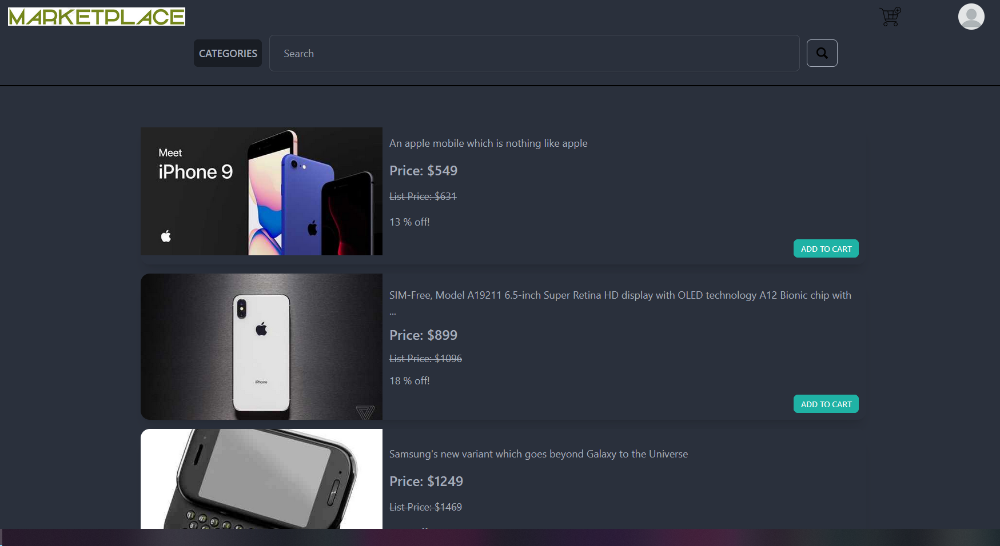

# The Marketplace

## Deployed Application

- [The Marketplace Application](https://group-3-marketplace.herokuapp.com/)

## Repo Link

- [The Marketplace Github Repo](https://github.com/nshaw973/Project-2-Interactive-Fullstack-App)

## About the Application

Application was created for the UCI bootcamp for project #2.

Our team had settled on creating an e-commerce like site that would allow the user to create an account, search for product, and "purchase" said product using a dummy pay system using stripe, and a database created using MYSQL that has about 100 dummy products to "purchase."

## How to Use

- When the user opens up the application, they are presented with the homepage.

- The user wont be able to search or add any items to their cart, unless they create an account.

- If the user selects the login button up top then they are brought to the login page.

  - The user will also be brought here if they click on the cart button.

- There the user can then login with their credentials, if its their first time on the application, then they can click on the the "Signup here" Button below.

- The user will then be prompted to insert their name, email, and password that must be a minimum of 8 characters long.

- Once the user has logged in or signed up, they will be directed to the account page with details, of their email, username, and how long they have been a member for.

- Here they are given some options for their account.

  - Change Profile picture - browse through the users drive and allows the user to pick a picture of their choosing, with a limmit of 1mb and must be a jpeg or png file.

  - Change Name - The user can change their username as well if desired.

- Now that the user is logged in, they have access to the rest of the site.

- The user can now search for items, or use the Categories tab.

- Once the user finds something they like, they can add to cart, and from there now the user can view their cart.

- The user can now either checkout, or go back to shopping if they'd like.

- on checkout the user is taken to a seperate site to add their payment information to "purchase" their "product"

## Future Development

These are some features we would like to add in the future for this application.

- Ability to view product pages and add comments and ratings.

- The ability to allow users to upload their own items to the database and have said items populate in their account for them to view

  - along side extra features for the user to view how many times their product has been viewd, and purchased.

- Ability to change email and password for the user using authentication methods.

## Collaborators

- Nathan Shaw

  - Github: [nshaw973](https://github.com/nshaw973)

- Cristino

  - Github: [cristino4](https://github.com/cristino4)

- Stephen

  - Github: [sbatelaan](https://github.com/sbatelaan)

- Kaden Inskeep

  - Github: [Tsukaden](https://github.com/Tsukaden)

- David

  - Github: [OppedRawen](https://github.com/OppedRawen)

## Technologies in Use

- Stripe
  - Payment purposes
- Multer
  - Allows the use of uploading new pictures.
- Heroku
  - Deployed on
- Tailwind
  - For CSS Styling
- daisyui
  - More CSS styling
- Prettier VSCode Extension
  - Cleanup code styling.
- Nodemon
  - Auto restarts local enviorment
- Express-Handlebars
  - Html styling
- Session
  - cookies
- MYSQL
  - Database, alongside mysql2 for js
- Sequelize
  - Interact with Database through js
- Express
  - Server functionality
- Bcrypt
  - encryption for password

## Screenshots

## Project Requirements

You and your group will use everything you’ve learned over the past six modules to create a real-world full-stack application that you’ll be able to showcase to potential employers. The user story and acceptance criteria will depend on the project that you create, but your project must fulfil the following requirements:

- Use Node.js and Express.js to create a RESTful API.

- Use Handlebars.js as the template engine.

- Use MySQL and the Sequelize ORM for the database.

- Have both GET and POST routes for retrieving and adding new data.

- Use at least one new library, package, or technology that we haven’t discussed.

- Have a folder structure that meets the MVC paradigm.

- Include authentication (express-session and cookies).

- Protect API keys and sensitive information with environment variables.

- Be deployed using Heroku (with data).

- Have a polished UI.

- Be responsive.

- Be interactive (i.e., accept and respond to user input).

- Meet good-quality coding standards (file structure, naming conventions, follows best practices for class/id naming conventions, indentation, quality comments, etc.).

- Have a professional README (with unique name, description, technologies used, screenshot, and link to deployed application).
